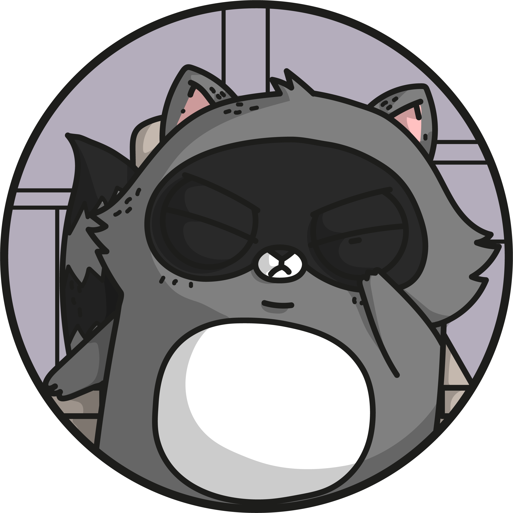
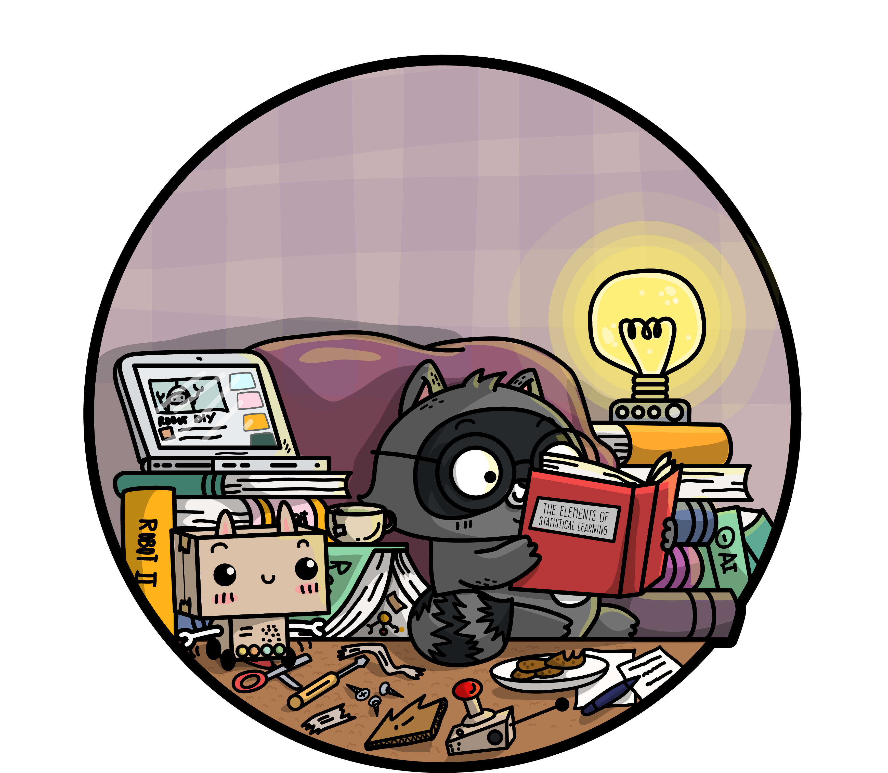
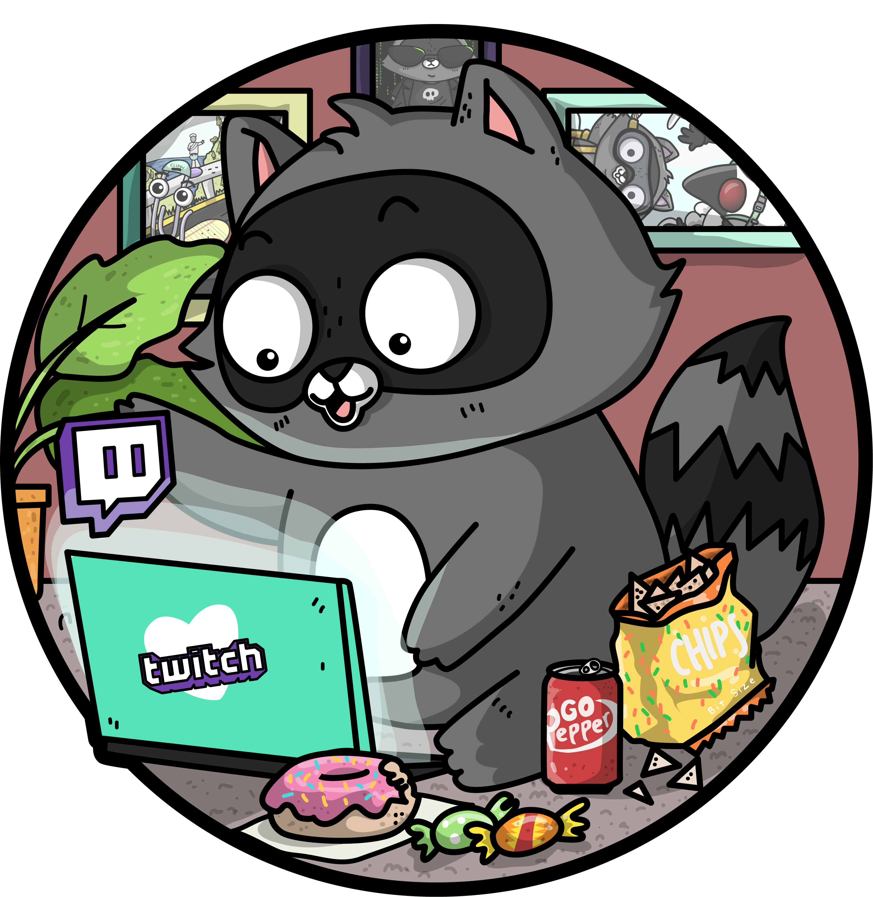
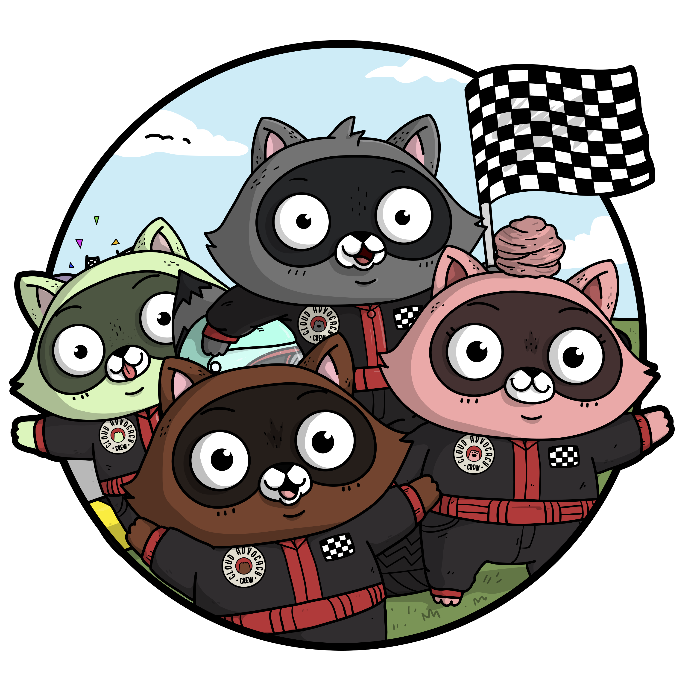

class: center, middle, inverse

# Background

---

# Setting the stage

* CBH is a non-profit created by the city of Philadelphia to manage all medicaid behavioral health claims for the city/county

--

* Starting in 2015, the organization wanted to move to more data-driven approaches to managing care
    * The bulk of our data are claims files and medicaid eligibility files

--

* As part of this, the Children's Clinical Team wanted to rethink how they were managing care for Family Based Services (FBS)
    * This is an EBP that serves ~300 children and their families each year, with a typical treatment course of 8 months

---
# The ask

"We want tiers! We're thinking like 3-4, they're not mutually exclusive, and the interventions aren't tier-specific."

--

--

<strong>Revised Ask</strong>

"We're currently treating everyone like they are high acuity.  But lots of our kids will be fine if we review their cases less often.  Can we find a way to focus our attention on the high risk cases, and do less frequent reviews for kids who are doing well in treatment?"

---
# Analytic Plan

.left-column[     
]

.right-column[
- Use all FBS episodes from 2012 - 2015 (if child had multiple cases, just use first)
    - N: 2441
- Negative outcome of interest: community removal in 6 months following FBS discharge
    - Defined as any days in Acute Inpatient, Residential Treatment Facility (RTF), Host Home, Crisis Residential Rehab (CRR), or being removed from the home by DHS.
    - 24.8% (n: 606)
- Other factors taken into consideration:
    - Service utilization in the 6 months before FBS
    - Service utilization while the member is in FBS
    - Demographics (race, age, gender, LOS in FBS, dose of FBS)]

---

# Special Considerations

.pull-left[
   
- We have no infrastructure to put a model into production in a conventional sense
- So whatever I develop, I need to also consider how clinical can implement the model on an ongoing basis
]
.pull-right[

]

---
# Modeling
.pull-left[
### Part 1: Random Forests 
- to look at variable importance with mean decrease in Gini
- I don't want to overwhelm clinical with lots of factors, since this will be a manual risk assessment process for them
  
- I don't just want to pick the statistically significant variables in the logistic model and trim backwards blindly. 

]

.pull-right[

]

---

background-image: url(AshleyMcnamaraArt/BIT_VSCODE.png)
background-position: 100% 0%
background-size: 25%

# Modeling
###Part 2: Logistic regressions 
- Used to create probabilities for community removal.
- Models trained on 70%, tested on 30%
- Factors in model trimmed based both on P-values and results of gini
- Results used to set a threshold for "high risk" of community removal

### Considerations: 
  - We want to evaluate folks both at time of admission and throughout their stay/at discharge; so we'll need 2 models
  - We want to catch as many of the cases who are "truly high risk" as possible
  - There's no risk to including "truly low risk" kids in the high risk category
  - The model will only serve as a guide for clinical; clinicians and providers can still elevate someone to high risk if they see red flags that the model can't capture
    - so we're also not too worried about incorrect identifications of "low risk"

---

# Ultimate Decision for Threshold
### "High Risk" defined as having a predicted probability of .2 or higher
- While this seems like a low threshold, this still cuts clinical's workload in half

PS: I did all this before I learned tidyverse and ggplot, so the visualizations are uglier than they needed to be 
---

# Putting It In "Production"
.pull-left[
- Luckily, few cases + long LOS = staff bandwith for manual calculator. 

- As with most corporate environments, excel is king

  - So I built 2 calculators for clinical in excel

- Also applied the models to all existing members in FBS, so the calculator was only for cases moving forward. 
]

.pull-right[  

]

---

#Up Up and Away
.pull-left[  
- Presented model, findings, and proposed new process to all professional stakeholders, both internal and external.
  - Not presented to members, as their experience should be entirely unchanged (this doesn't impact treatment delivery at all)
- New process, informed by the model, went live about 2 months after the analysis and calculator were built.
]

.pull-right[ 

]

---
# Model evaluation plans 
.pull-left[
- Routine monitoring limited to anecdotal evidence and ongoing checkins with Clinical
  - small N, long LOS, lack of tech infrastructure made ongoing monitoring difficult
  
- After 2 years (this summer), we'll compare predictions/new process with actual community removals.
  - Expectation: At the very least, we expect no change to community removals.
  - Additional data collection: cases where they elevated the model's predicted risk to "high"
]
.pull-right[   

]

---
class:  bottom, inverse

background-image:  url(AshleyMcnamaraArt/bit_unicorn.png)
background-size: cover

# Thanks!

Slides created via the R package [**xaringan**](https://github.com/yihui/xaringan).

Images created by [Ashley McNamara](https://github.com/ashleymcnamara/Developer-Advocate-Bit) 
